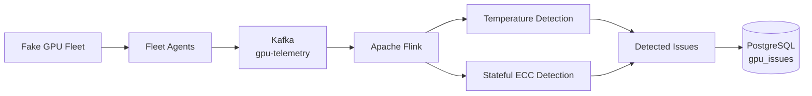
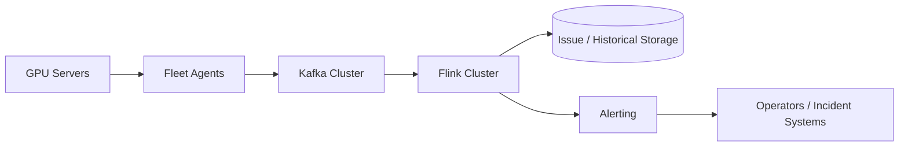

# GPU Fleet Health Monitor

A distributed GPU fleet health monitoring prototype built with **Python, Apache Kafka, Apache Flink, PostgreSQL, and Docker Compose**.

The project models GPU telemetry collection and real-time health processing for a fleet of NVIDIA GPU servers. It is designed as a small-scale prototype for exploring the architecture and trade-offs involved in monitoring a much larger fleet, with a target design scale of approximately **600,000 GPUs** and a requirement to detect and report critical GPU/server issues within **30 minutes**.

> This repository is a functional prototype and architecture exercise. It does **not** simulate 600,000 physical GPUs or processes. The current implementation uses a small logical fleet while focusing on the distributed data pipeline and health-processing model.

## Architecture



### Data Flow

```text
FakeGPU / FakeServer
        ↓
FakeAgent
        ↓
GPU telemetry
        ↓
Kafka Producer
        ↓
gpu-telemetry topic
        ↓
Apache Flink
        ↓
Health Detection
        ↓
PostgreSQL
```

The components are intentionally separated by responsibility:

* **Fleet simulator** generates logical GPU/server state.
* **Fleet agents** collect GPU telemetry.
* **Kafka** decouples telemetry producers from downstream processing.
* **Flink** performs real-time health evaluation.
* **PostgreSQL** provides durable storage for detected issues.

## Current Implementation

The current local environment simulates:

```text
3 servers
×
4 GPUs per server
=
12 logical GPUs
```

Each simulation round generates one telemetry event per GPU and publishes the events to Kafka.

The small fleet size is intentional. Scaling the logical fleet does not require creating one operating-system process per GPU.

## GPU Telemetry

Each simulated GPU exposes telemetry including:

```text
rack_id
server_id
gpu_id
gpu_temperature
gpu_power
gpu_utilization
gpu_ecc_single_bit_errors
gpu_ecc_double_bit_errors
gpu_xid_errors
gpu_nvlink_errors
collect_time
```

Example:

```json
{
  "rack_id": "rack-0",
  "server_id": "server-1",
  "gpu_id": 3,
  "gpu_temperature": 87.5,
  "gpu_power": 1400,
  "gpu_utilization": 95,
  "gpu_ecc_single_bit_errors": 0,
  "gpu_ecc_double_bit_errors": 0,
  "gpu_xid_errors": 0,
  "gpu_nvlink_errors": 0,
  "collect_time": "2026-09-11 06:25:28.946334"
}
```

## Kafka Ingestion

Fleet telemetry is published to the Kafka topic:

```text
gpu-telemetry
```

The topic currently uses **3 partitions**.

The Kafka producer uses `server_id` as the message key:

```python
self.producer.send(
    self.topic,
    key=record["server_id"].encode("utf-8"),
    value=record,
)
```

Using the server ID as the partition key keeps telemetry from the same server in the same Kafka partition while the partition count remains unchanged.

This provides an important property for downstream health processing:

```text
same server
    ↓
same Kafka key
    ↓
same partition
    ↓
ordered telemetry within that partition
```

Kafka also decouples telemetry generation from health processing. Fleet agents do not need to know how or where telemetry will eventually be analyzed.

## Flink Stream Processing

Apache Flink consumes the `gpu-telemetry` Kafka topic and performs real-time health evaluation.

The current pipeline implements two types of processing:

```text
Temperature
→ stateless processing

ECC counters
→ stateful processing
```

### Temperature Detection

Temperature can be evaluated using only the current telemetry event.

Current thresholds:

```text
Temperature <= 85°C       → Normal
85°C < Temperature < 90°C → WARNING
Temperature >= 90°C       → CRITICAL
```

For example:

```text
87.5°C
    ↓
HIGH_TEMPERATURE
    ↓
WARNING
```

This is **stateless stream processing** because no previous event is required.

## Stateful ECC Detection

ECC detection is different because the telemetry contains cumulative error counters.

For example:

```text
Previous double-bit ECC count: 0
Current double-bit ECC count:  1
                               ↑
                         new ECC error
```

Flink first partitions the telemetry stream logically by GPU:

```text
server_id + gpu_id
```

For example:

```text
server-0:3
server-1:3
server-2:3
```

Each GPU therefore maintains independent Flink keyed state.

The processor stores the previous ECC counters using `ValueState` and compares them with the current telemetry event.

A double-bit ECC counter increase produces:

```text
issue_type: UNCORRECTABLE_ECC_ERROR
severity: CRITICAL
```

A single-bit ECC counter increase produces:

```text
issue_type: CORRECTABLE_ECC_ERROR
severity: WARNING
```

This demonstrates the difference between **stateless threshold evaluation** and **stateful event detection** in a streaming system.

## PostgreSQL Issue Storage

Detected health issues are persisted to PostgreSQL in the:

```text
gpu_issues
```

table.

The stored data includes:

```text
rack_id
server_id
gpu_id
issue_type
severity
temperature
previous_count
current_count
collect_time
detected_at
```

Example temperature issue:

```text
server-0
GPU 0
HIGH_TEMPERATURE
WARNING
87.5°C
```

Example ECC issue:

```text
server-0
GPU 3
UNCORRECTABLE_ECC_ERROR
CRITICAL
previous_count = 0
current_count  = 1
```

The prototype currently uses a Python PostgreSQL writer from the Flink processing pipeline.

For simplicity, each detected issue is committed directly. A production implementation would use batching, retries, idempotent writes, connection management, and checkpoint-aware sink semantics.

## Failure Simulation

The simulator currently exercises two health scenarios.

### Temperature Increase

GPU utilization increases over multiple simulation rounds, which raises the simulated GPU temperature.

The temperature model is intentionally simple:

```text
Temperature = 0.5 × Utilization + 40
```

It is designed to generate predictable telemetry for testing rather than model real GPU thermal behavior.

### ECC Injection

A double-bit ECC error is injected into GPU 3:

```text
ECC double-bit counter
0 → 1
```

Flink detects the counter transition and generates a CRITICAL uncorrectable ECC issue.

A simulated server power cycle resets the error counters.

## Running the End-to-End Demo

### 1. Start the infrastructure

```bash
docker compose up -d kafka postgres jobmanager taskmanager
```

Verify the services:

```bash
docker compose ps
```

### 2. Submit the Flink health-processing job

```bash
docker exec -it flink-jobmanager \
  flink run -d -py /app/flink_processor.py
```

Verify that the job is running:

```bash
docker exec -it flink-jobmanager flink list
```

Expected job:

```text
GPU Fleet Health Processor (RUNNING)
```

### 3. Run the GPU fleet simulator

```bash
docker compose up simulator
```

The simulator publishes telemetry into Kafka while Flink processes the stream.

### 4. Inspect detected issues

Flink processing output can be inspected with:

```bash
docker logs flink-taskmanager
```

For ECC issues:

```bash
docker logs flink-taskmanager 2>&1 | grep ECC
```

### 5. Query PostgreSQL

```bash
docker exec -it postgres \
  psql -U gpu_user -d gpu_monitor
```

Then:

```sql
SELECT
    id,
    server_id,
    gpu_id,
    issue_type,
    severity,
    temperature,
    previous_count,
    current_count
FROM gpu_issues
ORDER BY id;
```

The result should contain both temperature warnings and injected ECC failures.

## Repository Structure

```text
gpu-fleet-monitor/
├── main.py                 # GPU fleet simulator and telemetry generation
├── kafka_ingestion.py      # Kafka telemetry producer
├── flink_processor.py      # Flink health-processing pipeline
├── Dockerfile              # Simulator container
├── flink.Dockerfile        # Flink/PyFlink runtime
├── compose.yaml            # Local distributed environment
├── requirements.txt
└── README.md
```

## Scaling Toward 600,000 GPUs

The current implementation intentionally runs a small logical fleet.

A production deployment at hundreds of thousands of GPUs would require scaling each layer independently.



### Fleet Collection

A production system would run lightweight agents across GPU servers rather than one process per GPU.

Each agent could collect telemetry for all GPUs installed in its local server and periodically publish batched or individual telemetry events.

### Kafka

Kafka provides horizontal ingestion capacity through partitions and brokers.

Important production considerations include:

* partition count
* partition-key strategy
* replication
* producer batching
* consumer lag
* retention
* backpressure
* retry behavior

Partitioning by server ID preserves per-server ordering while distributing servers across Kafka partitions.

### Flink

Flink processing can scale through parallel operators.

Keyed processing allows state associated with an individual GPU to remain logically isolated even when the workload is distributed across multiple workers.

At larger scale, Flink would also require:

* checkpointing
* state backend configuration
* failure recovery
* backpressure monitoring
* checkpoint storage
* resource sizing
* processing-latency monitoring

### PostgreSQL and Storage

The prototype stores detected issues rather than every raw telemetry event.

At production scale, raw high-volume telemetry and operational issue records may have different storage requirements.

PostgreSQL can remain useful for structured operational data such as:

```text
active issues
incident state
server/GPU metadata
health transitions
alert history
```

High-volume historical telemetry could instead be retained in a time-series or object-storage system depending on query and retention requirements.

## Detection-Latency Requirement

The target architecture assumes critical GPU/server problems should be detected and reported within **30 minutes**.

Rather than treating this as one opaque number, the latency budget can be decomposed into:

```text
Telemetry collection latency
        +
Kafka ingestion latency
        +
Consumer lag
        +
Flink processing latency
        +
Issue persistence latency
        +
Alert delivery latency
        =
End-to-end detection/reporting latency
```

Each stage should expose metrics so the system can determine where the latency budget is being consumed.

## Current Limitations

This repository is a prototype and intentionally leaves several production concerns unresolved.

Current limitations include:

* No Kafka broker replication in the local environment.
* No production-grade Flink checkpoint/recovery configuration.
* PostgreSQL writes are not checkpoint-aware or exactly-once.
* Replaying Kafka telemetry can produce duplicate database issues.
* No alert manager or notification integration.
* No rack-level failure correlation.
* No XID/NVLink processing pipeline yet.
* No large-scale load test has been performed.

These are deliberate boundaries of the current implementation rather than claims of production readiness.

## Potential Next Steps

Future work could include:

* idempotent issue writes and deduplication
* Flink checkpointing and recovery
* XID and NVLink health rules
* rack-level failure correlation
* alert aggregation
* consumer-lag monitoring
* telemetry throughput benchmarking
* capacity planning at 1K, 10K, 100K, and 600K logical GPUs
* explicit SLI/SLO measurement for detection latency

## Design Goal

The primary goal of this project is not to build a realistic GPU simulator.

It is to explore the distributed-systems problems that appear when GPU health monitoring moves from a single server toward fleet scale:

```text
How should telemetry be collected?

How should producers and consumers be decoupled?

How should telemetry be partitioned?

How can per-GPU state be maintained in a distributed stream processor?

How should failures be persisted and queried?

How can the monitoring pipeline scale horizontally?

How can critical failures be detected within a defined latency budget?
```

The current prototype provides a working end-to-end foundation for exploring those questions.
